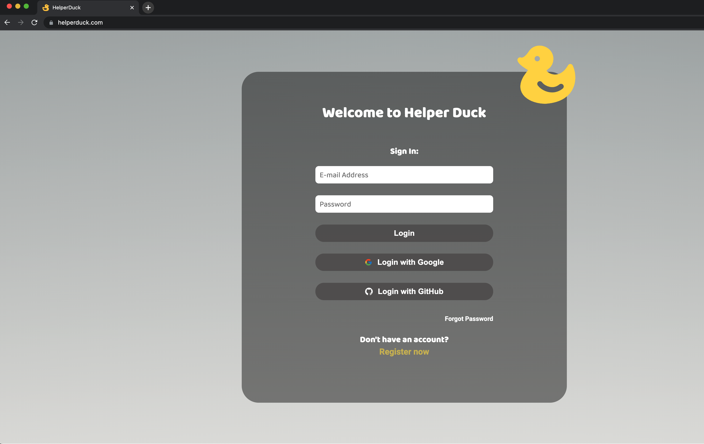
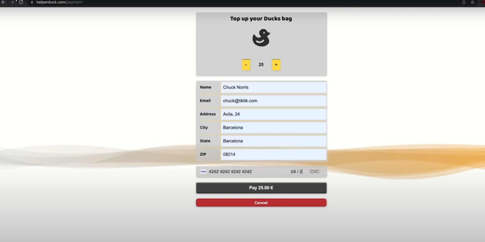
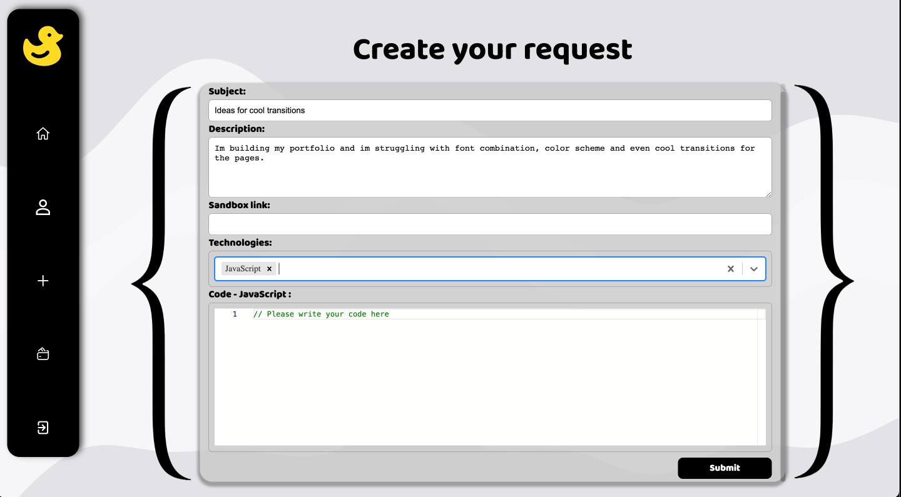
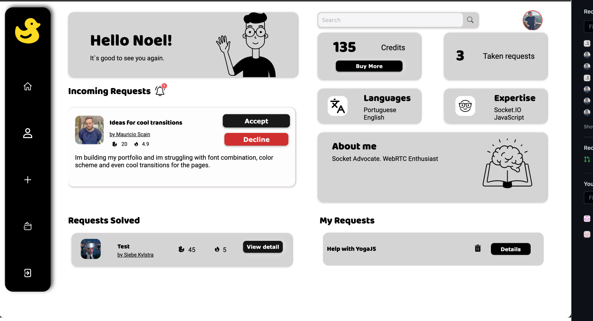
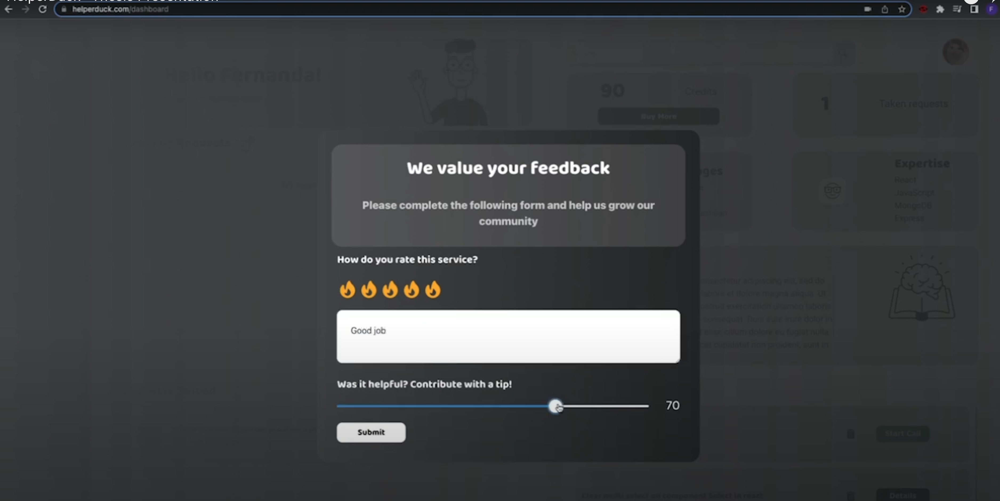

# HelperDuck

Frontend repository of <a href="www.helperduck.com" target="_blank">helperduck.com</a>, a platform that enables real-time communication between developers and rewards them with tips for their help.

## Create help requests and be assisted by other other developers on a 1-on-1 video call
### Watch a demo on [Youtube](https://www.youtube.com/watch?v=MDiG2i5okxg)

### User Journey

1. Authentication: The user may create an account and sign-in using Gmail, GitHub or email.
2. Profile and Payments: Once signed in, the user can edit the profile, add the technologies in which is willing to help other developers, and purchase credits using a credit card.
3. Create Help Request: Provide a description of the problem you are facing, include a code snippet and choose the related technologies.
4. Matching help requests: The help request will be broadcasted to other users who have the mentioned technologies among their expertise.
5. Video call: Once someone offers an help request, the user can accept it and engage in a peer-to-peer video call, with an option to share the screen for better assistance.
6. Reviews and Rewards: at the end of the call, both participants are prompted to review each other, and the person who asked for help has the opportunity to give a tip to the developer who provided help.
7. Rating and balance: The credits are then transferred to the other party's balance, the ratings are updated, and the help requests are indexed to the Past requests section.

### Created by

- Fernanda Rodrigues - github.com/fegananca
- Mauricio Scain - github.com/scainMauricio
- Noel Vieira - github.com/noelcv
- Siebe Kylstra - github.com/siebe88

### Authentication

</img>

### User Dashboard

</img>

### User Profile

</img>

### Payment - Stripe Integration

</img>

### Create Help Request

</img>

### Matching and Accepting Help Request

</img>

### Video Call

</img>

### Review and Tipping
</img>

### Setup

Install the necessary packages - `npm install`

### Start

In the project directory -   `npm start`
